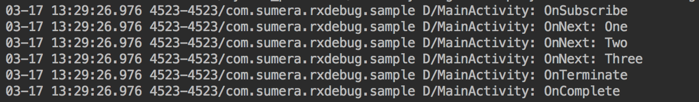
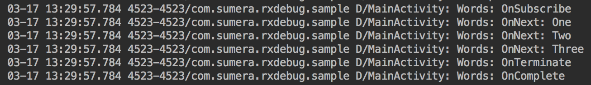

# RxDebug
Simple kotlin extension for logging useful information from RxJava2 streams.

The debug extension will automatically figure out from which class it's being called and use that class name as its tag.

## Usage
```Kotlin
Observable.just("One", "Two", "Three")
        .debug()
        .subscribe()
```

This will produce the following output to log:



OR

```Kotlin
Observable.just("One", "Two", "Three")
        .debug(tag = "Words")
        .subscribe()
```

This will produce the following output to log:



All RxJava2 stream types are supported _(Observable, Flowable, Single, Maybe, Completable)_
